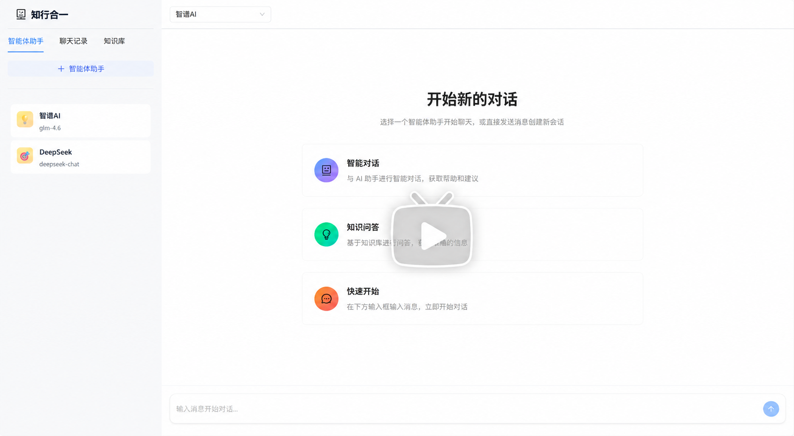
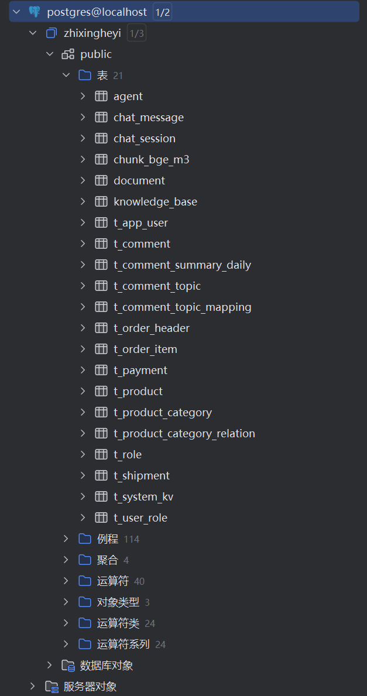
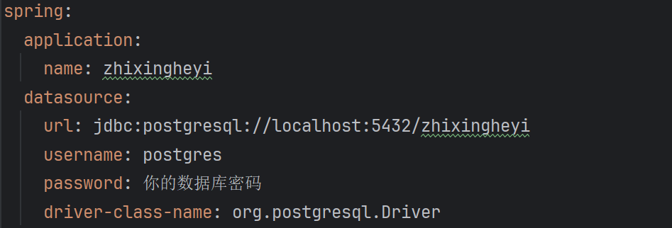
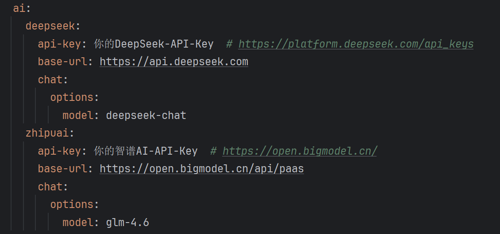
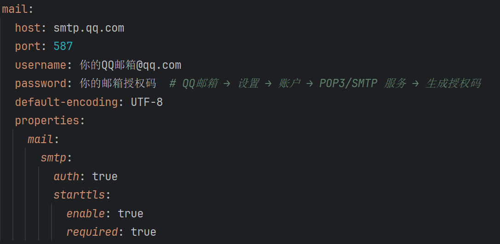
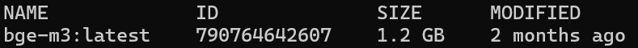
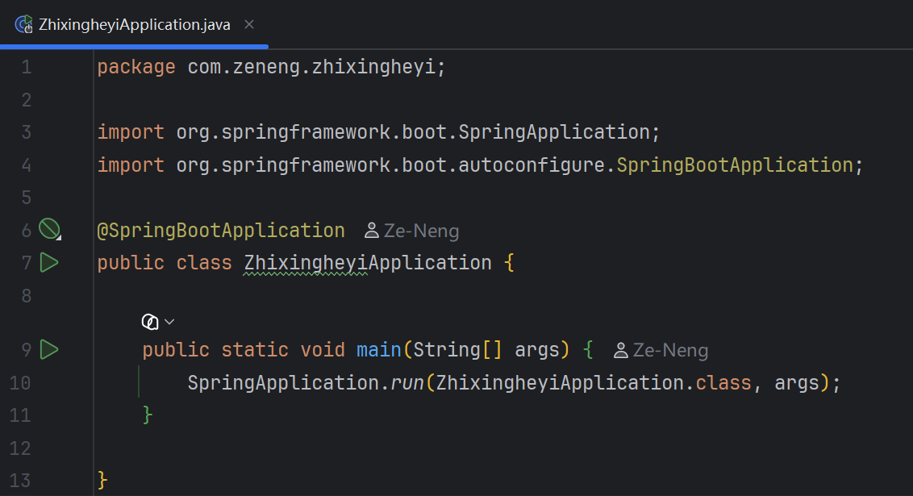

# 知行合一 — AI Agent 系统

> 一个具备自主决策、工具调用、知识库检索的 AI Agent 系统。

## 项目简介

**知行合一**是一个基于 Spring AI 框架的 AI Agent 系统，实现了 **Think-Execute 循环机制**——Agent 能够理解复杂任务、规划执行步骤、调用外部工具，并基于 RAG 技术从知识库中检索相关信息，完成多步骤的复杂任务。

## 项目演示

[](https://www.bilibili.com/video/BV1wrjH6kEfn/?spm_id_from=333.1387.homepage.video_card.click&vd_source=fb7bc41cf1c618fadfe9caa67625dc40)

点击图片跳转b站播放

视频内容速览：

- 0:01 —— 创建智能体
- 1:40 —— 天气查询
- 2:00 —— 新建知识库 + 上传文档 + 生成报告 + 发送邮件

## 核心特性

- **Think-Execute 循环**：多轮自主决策，LLM 每一步自行判断是否需要调用工具
- **工具调用框架**：统一 Tool 接口，FIXED/OPTIONAL 两级分类，最小权限原则
- **RAG 知识库**：固定大小分块 + 滑动窗口重叠 + bge-m3 嵌入 + pgvector 向量检索
- **多模型支持**：注册表模式（ChatClientRegistry），支持 DeepSeek/GLM 动态切换
- **SSE 实时推送**：Agent 执行过程全链路可观测（PLANNING → THINKING → EXECUTING → FINISHED）

## 可用工具一览

### FIXED 工具（所有 Agent 默认拥有）

| 工具            | 功能                            |
| --------------- | ------------------------------- |
| `terminate`     | 结束 Agent 循环，任务完成时调用 |
| `KnowledgeTool` | RAG 知识库语义检索              |
| `dateTool`      | 获取当前日期                    |

### OPTIONAL 工具（创建 Agent 时可勾选）

| 工具               | 功能                                            |
| ------------------ | ----------------------------------------------- |
| `dataBaseTool`     | PostgreSQL 只读查询（仅允许 SELECT）            |
| `emailTool`        | QQ 邮箱 SMTP 异步发送邮件                       |
| `weatherQueryTool` | Open-Meteo 天气查询（支持城市名或 IP 自动定位） |

## 技术栈

| 层级     | 技术                                                     |
| -------- | -------------------------------------------------------- |
| 后端框架 | Java 17, Spring Boot 3.5, Spring AI 1.1                  |
| 数据库   | PostgreSQL + pgvector 扩展                               |
| ORM      | MyBatis 3                                                |
| LLM      | DeepSeek (`deepseek-chat`), 智谱 AI (`glm-4.6`)          |
| 嵌入模型 | Ollama + bge-m3 (1024 维)                                |
| 前端     | React 19, TypeScript, Vite, Ant Design 6, Tailwind CSS 4 |

## 系统架构

```
前端 (React) ←→ Controller (REST API) ←→ Service (业务逻辑)
                                              ↕
                                    Agent 核心 (Think-Execute 循环)
                                    ├─ ChatClientRegistry (多模型)
                                    ├─ Tool System (FIXED + OPTIONAL)
                                    │   ├─ TerminateTool (终止任务)
                                    │   ├─ KnowledgeTools (RAG 检索)
                                    │   ├─ DataBaseTools (数据库查询)
                                    │   ├─ EmailTools (邮件发送)
                                    │   └─ WeatherQueryTool (天气查询)
                                    └─ RAG Service (pgvector)
                                              ↕
                                    PostgreSQL (业务数据 + 向量数据)
```

## 快速开始

### 一、环境要求

在开始构建 知行合一 AI Agent 系统之前，请确保你的本地环境满足以下要求。

- JDK 17+

  > Spring Boot 3.x的最低要求（需要支持 Spring AI)

- PostgreSQL 14+（需启用 pgvector 扩展）

  > 因为需要支持向量索引，MySQL 不支持向量，所以采用 PostgreSQL。

  > Windows 下安装 pgvector 插件比较困难，建议 Windows 用户通过 docker 使用 PostgreSQL。

  > docker 拉取 pgvector 的 image 如果因为网络问题失败，推荐使用这个镜像网站：https://docker.aityp.com/

  > SQL 脚本在项目根目录的 sql 文件夹里，eshop.md 文件是用于项目功能演示的电商系统数据库设计文档

- IDE

  > IntelliJ IDEA (推荐)

- Ollama

  > 用于本地运行 bge-m3 嵌入模型

- Node.js 22+

  > 用于前端界面（ React / Vite ）

- Docker (可选)

  > 用于快速启动 PostgreSQL

  > 部署 pgvector

### 二、配置步骤

#### 1. 下载源码

```bash
git clone https://github.com/Ze-Neng/zhixingheyi-ai-agent.git
```

#### 2. 创建数据库

```sql
CREATE DATABASE zhixingheyi;
```

#### 3. 建表

```sql
psql -d zhixingheyi -f sql/zhixingheyi.sql
psql -d zhixingheyi -f sql/eshop.sql
psql -d zhixingheyi -f sql/eshop_data.sql
```

数据库脚本说明：

- `zhixingheyi.sql`
  项目的**主业务数据库脚本**，用于创建并维护知行合一系统自身所需的核心表结构（如 Agent、会话、消息、知识库等）。

- `eshop.sql`
  专门用于 **AI 测试与演示 SQL 能力的示例数据库结构**。
  出于多数据源配置复杂度的考虑，`eshop` 并未单独部署数据库实例，而是**在物理层面与知行合一系统共用同一个 PostgreSQL 数据库**。

- `eshop_data.sql`
  `eshop` 示例数据库的**模拟业务数据脚本**，用于为 AI 生成、执行和分析 SQL 提供可操作的数据环境。

建表结果最终如下：



#### 4. 修改配置

```bash
cp application-example.yaml application.yaml
```

或者自己手动复制一份`application-example.yaml`文件然后重命名为`application.yaml`

编辑`知行合一/src/main/resources/application.yaml`配置文件

##### 4.1 配置数据库连接



##### 4.2 配置模型的 API Key


怎么获取 API Key ？

- DeepSeek：https://platform.deepseek.com/api_keys
- 智谱 AI：https://open.bigmodel.cn/

##### 4.3 配置邮件服务（QQ邮箱）



#### 5.本地部署 bge-m3 模型

拉取模型：

```bash
ollama pull bge-m3
```

查看拉取结果：

```bash
ollama list
```

拉取成功结果：



### 三、项目启动

#### 1. 启动前端

##### 1.1 下载依赖

```bash
cd ui
npm install
```

##### 1.2 运行项目

```bash
npm run dev  # http://localhost:5173
```

#### 2. 启动后端

##### 2.1 命令行方式

```bash
cd 知行合一
mvn spring-boot:run
```

##### 2.2 UI 界面 （IntelliJ IDEA）

找到启动类：`知行合一/src/main/java/com/zeneng/zhixingheyi/ZhixingheyiApplication.java`打开



然后点击第9行绿色三角▷启动后端

## 许可证

MIT License
